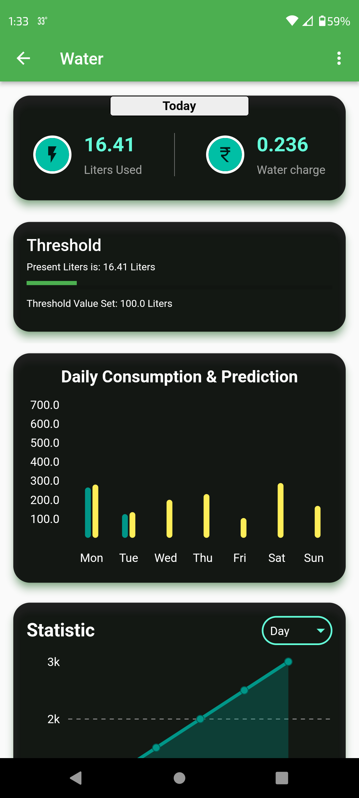
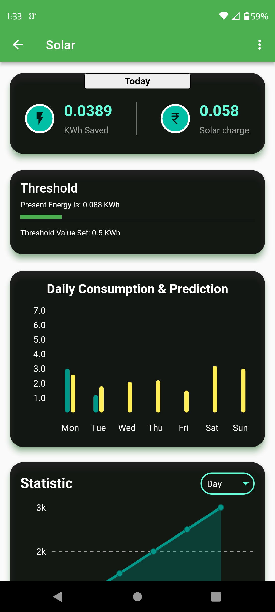

# Intelligent Resources Consumption System (IRCS)

This is a repository that showcases the Intelligent Resources Consumption System [IRCS] app with all its UI and features. 

# Introduction
IRCS is a comprehensive Flutter application designed for real-time analytics and monitoring of household resources, including electricity, water consumption, and tracking of solar energy production. With intuitive interfaces and powerful predictive analytics, IRCS empowers users to make informed decisions about their resource usage, leading to more efficient and sustainable practices.

# Features 
+ Real-time Analytics: View real-time data on resource consumption through interactive charts and graphs.
+ Predictive Insights: Utilize predictive analytics to forecast future resource usage trends.
+ Customization: Set personalized thresholds for each resource and receive timely alerts when thresholds are exceeded.
+ Multi-screen Interface: Navigate seamlessly between screens dedicated to individual resources, a consolidated dashboard, device status, alerts, and user profile settings.
+ Device Status Monitoring: Track the online/offline status of monitoring devices to ensure data accuracy.
+ User Profiles: Access and manage user profiles, including username, device ID, and support resources.

# Screenshots

  
  
  

  
  
  
  

  
  
  

# Technologies Used
+ Flutter: Cross-platform UI toolkit for building natively compiled applications.
+ Provider: State management solution for Flutter applications.
+ Other plugins: Includes other plugins/libraries used in this project like flutter and syncfusion charts,
   geolocator, lottie and rive animations, shared preferences, firebase core and auth, googleapis and so on.

# License
This project is licensed under the MIT License.

# Contact
For any inquiries or support regarding IRCS, feel free to contact me at nidhinshajujoseph@gmail.com.
